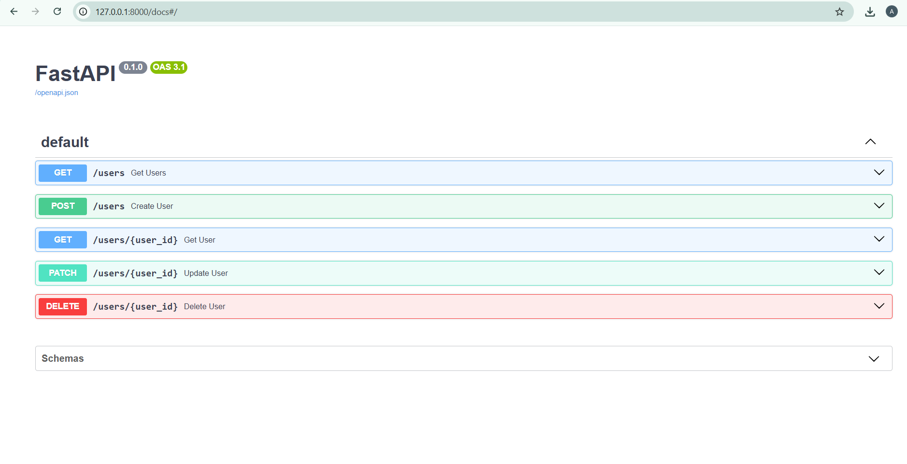
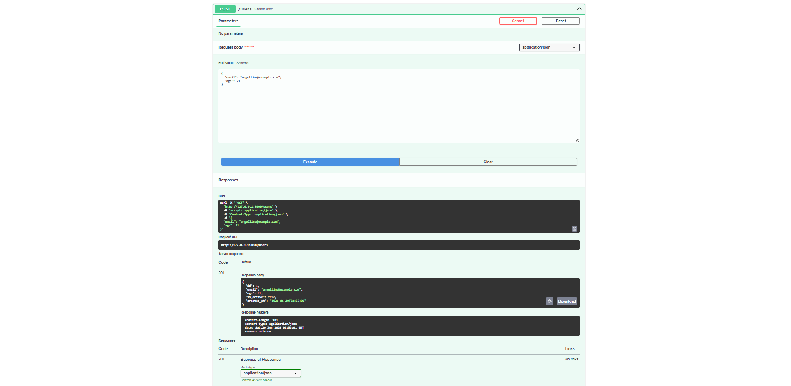
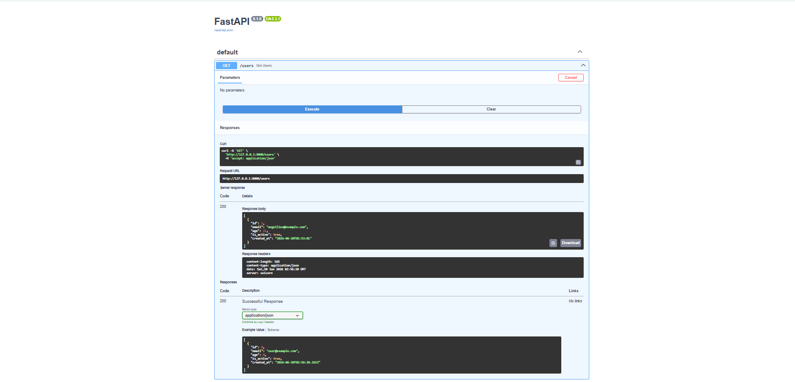
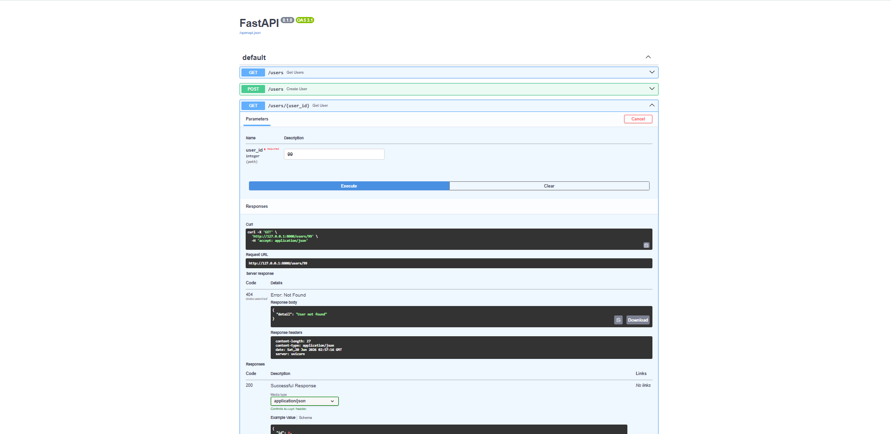
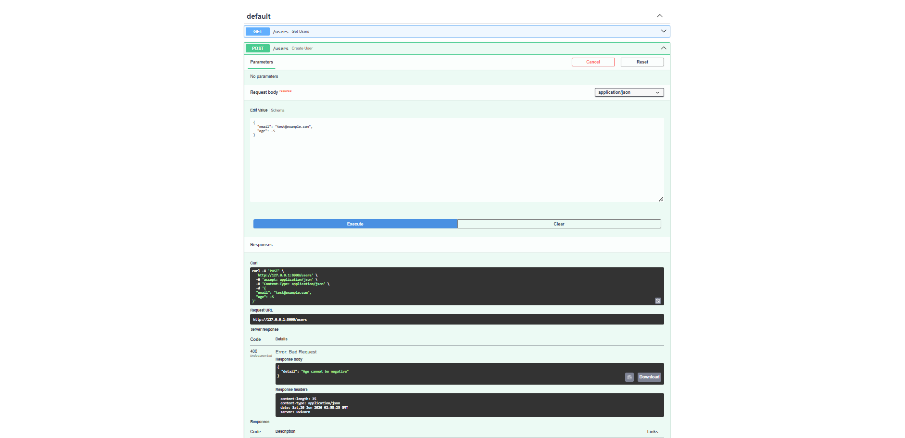
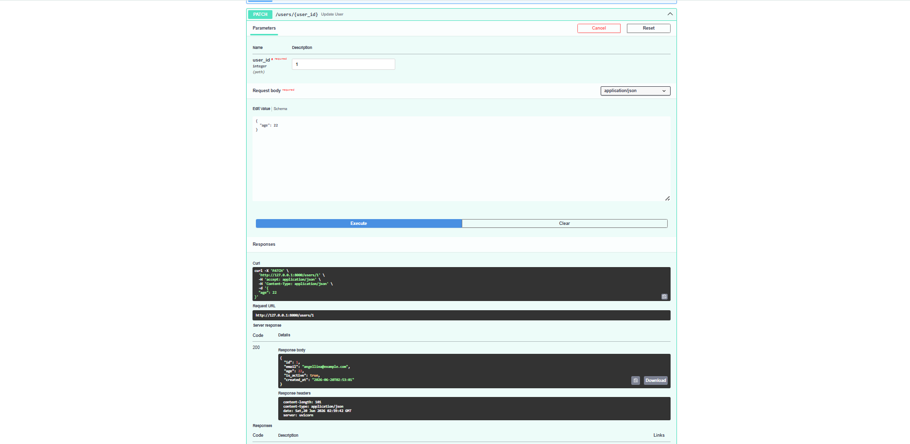
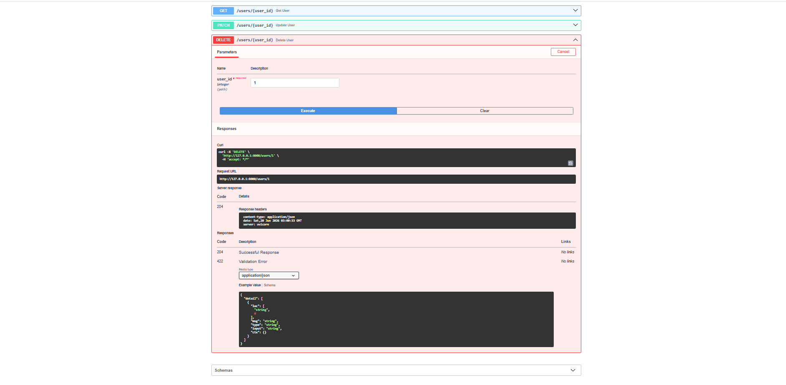

# Project 2: Database Integration (CRUD)
**Decode Labs Backend Development Internship**
Built by: Angellina Joyce Paul

## 📌 About
A REST API with full CRUD operations connected to a SQLite database using SQLAlchemy ORM.

## 🛠️ Tech Stack
- Python 3.14
- FastAPI
- SQLAlchemy
- SQLite
- Pydantic

## 🚀 How to Run
1. Create virtual environment
   python -m venv venv
   venv\Scripts\activate

2. Install dependencies
   pip install fastapi uvicorn sqlalchemy pydantic[email]

3. Run the server
   uvicorn main:app --reload

4. Open docs at
   http://127.0.0.1:8000/docs

## 📡 API Routes
| Method | Route | Description | Status Code |
|--------|-------|-------------|-------------|
| POST | /users | Create new user | 201 / 400 / 409 |
| GET | /users | Get all users | 200 |
| GET | /users/{id} | Get single user | 200 / 404 |
| PATCH | /users/{id} | Update user | 200 / 404 / 409 |
| DELETE | /users/{id} | Delete user | 204 / 404 |

## 📸 Screenshots
### Swagger UI Homepage

### POST /users — 201 Created

### POST /users — 409 Conflict

### GET /users — 200 OK

### GET /users/99 — 404 Not Found

### POST /users — 400 Bad Request

### PATCH /users/1 — 200 Updated

### DELETE /users/1 — 204 No Content
